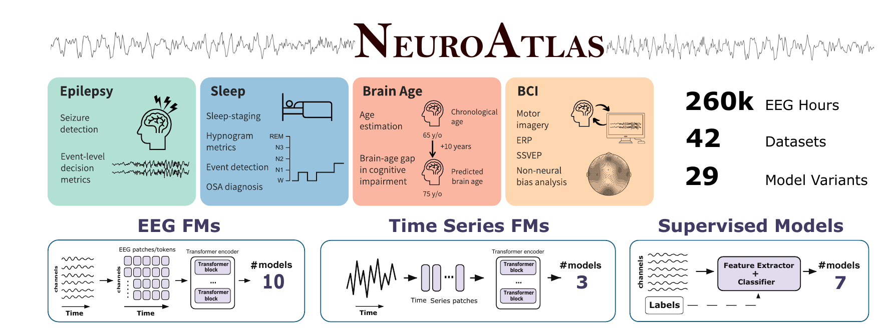

<h1 align="center">NeuroAtlas: Benchmarking Foundation Models for<br>Clinical EEG and Brain-Computer Interfaces</h1>

<p align="center">
Konstantinos Kontras<sup>1,2,*</sup>, Trui Osselaer<sup>1,*</sup>, Stylianos G. Mouslech<sup>1,*</sup>,
Angeliki-Ilektra Karaiskou<sup>1,*</sup>, Guido Gagliardi<sup>1,*</sup>, Thomas Strypsteen<sup>1,*</sup>,
Mohammad Hossein Badiei<sup>1</sup>, Anku Rani<sup>2</sup>, Maarten Vanmarcke<sup>1</sup>,
Miguel Bhagubai<sup>1</sup>, Chanakya Ekbote<sup>2</sup>, Jaedong Hwang<sup>2</sup>,
Christos Chatzichristos<sup>1</sup>, Paul Pu Liang<sup>2</sup>, Maarten De Vos<sup>1</sup>
<br>
<sup>1</sup>KU Leuven &nbsp; <sup>2</sup>MIT &nbsp; <sup>*</sup>Equal contribution
</p>

<p align="center">
<a href="https://arxiv.org/abs/2605.14698">Paper</a> |
<a href="docs/user_guide.md">User guide</a> |
<a href="docs/cli.md">Command reference</a> |
<a href="#citation">Citation</a>
</p>



## Abstract

Foundation models (FMs) promise to extract unified representations that generalize across
downstream tasks. They have emerged across fields including electroencephalography (EEG), but it
is less clear how effective they are in this particular field. Published evaluations differ in
datasets, in the EEG-specific preprocessing that might influence reported results, and in the
reported metrics frequently obscuring the clinical relevance in EEG. We introduce NeuroAtlas, the
largest EEG benchmark to date: 42 datasets and ∼260k hours covering clinical EEG (epilepsy, sleep
medicine, brain age estimation) and brain-computer interfaces, and include multiple datasets per
task along with bespoke clinical evaluation metrics. Besides evaluating EEG-FMs with respect to
supervised baselines, we present results from generic time-series FMs. We report three findings.
First, EEG-specific FMs do not consistently outperform time-series FMs which have neither
EEG-focused architectures nor been pretrained on EEG. Second, standard machine learning metrics
are insufficient to assess clinical utility: Thus, we thoroughly evaluate more appropriate
measures such as the quality of event-level decision-making, hypnogram-derived features, and the
brain-age gap in the domains of epilepsy, sleep and brain age respectively. Third, model rankings
and performance can vary substantially within domains. We conclude that pretrained models perform
largely on par, with only narrow advantages for a few, and that current FMs do not yet deliver on
the promise of an out-of-the-box unified EEG model. NeuroAtlas exposes this gap and provides the
datasets and metrics for the next generation of unified EEG-FMs.

## Overview

This repository contains the code to run the NeuroAtlas benchmark. It is installed as a Python
package that provides the `neuroatlas` command. The command downloads datasets and model weights,
extracts embeddings with a frozen backbone, trains the probes on the paper's folds and reports
the results.

The benchmark has 12 tasks across four domains, 42 datasets and 44 model checkpoints. The models
fall into four groups: EEG foundation models, time-series foundation models, supervised
baselines, and randomly initialized baselines.

## Installation

We tested the code on Linux with Python 3.11.

```bash
git clone https://github.com/kkontras/NeuroAtlas.git
cd NeuroAtlas
conda create -n neuroatlas python=3.11 -y
conda activate neuroatlas
pip install -e ".[fm]" -c requirements-fm.txt
```

`requirements-fm.txt` pins every dependency to the version used in the paper. The install takes
about 5 minutes and 6.5 GB of disk space.

Some models and datasets need extra packages:

```bash
# BCI datasets (MOABB)
pip install -e ".[fm,bci]" -c requirements-fm.txt
pip install --no-deps "moabb==1.2.0"

# Chronos and MOMENT
pip install -e ".[fm,ts]" -c requirements-fm.txt
pip install --no-deps "momentfm==0.1.4"
```

Moirai needs an older PyTorch and has its own environment, described in `requirements-tsfm.txt`.

The default PyTorch build needs a GPU with compute capability 7.5 or higher and a CUDA 13 driver.
On older hardware, install a CUDA 12 build of PyTorch first. The probes themselves run on the CPU.

Note that the package on PyPI called `neuroatlas` is unrelated to this project.

## Quick start

Set the folders for data, cache, results and model weights:

```bash
neuroatlas config init --data-root ~/eeg/data --cache-root ~/eeg/cache \
    --output-root ~/eeg/results --models-root ~/eeg/models
```

Download Sleep-EDF and the BIOT weights, then run sleep staging:

```bash
neuroatlas data download sleep_edf_expanded --mirror aws
neuroatlas models download biot_pretrained

neuroatlas check sleep_stage -m biot_pretrained          # quick test on one batch
neuroatlas run sleep_stage -m biot_pretrained --debug    # fold 0 only
neuroatlas run sleep_stage -m biot_pretrained            # all folds
neuroatlas results sleep_stage
```

See [docs/walkthrough.md](docs/walkthrough.md) for a full example with the expected output.

## Benchmarks

| Benchmark | Domain | Metric | Datasets |
|---|---|---|---|
| `sleep_stage` | Sleep | Cohen's κ | 15 |
| `sleep_hypnogram` | Sleep | Pearson r of hypnogram features | 8 |
| `sleep_diagnosis` | Sleep | AUROC | 3 |
| `sleep_arousal` | Sleep | AUPRC | 2 |
| `sleep_respiratory` | Sleep | AUPRC | 2 |
| `sleep_limb` | Sleep | AUPRC | 1 |
| `brain_age` | Brain age | MAE (years) | 6 |
| `epilepsy` | Epilepsy | Event-level Sens@FA AUC | 10 |
| `bci_motor_imagery` | BCI | Balanced accuracy | 7 |
| `bci_erp` | BCI | Balanced accuracy | 5 |
| `bci_ssvep` | BCI | Balanced accuracy | 2 |
| `bci_cognitive` | BCI | Balanced accuracy | 4 |

Every benchmark runs the same way:

```bash
neuroatlas show epilepsy                          # description, datasets and commands
neuroatlas run epilepsy -m cbramod_pretrained     # its default dataset (Siena)
neuroatlas run epilepsy -m all_fm --dataset full  # all EEG FMs on all datasets you have
neuroatlas results epilepsy
```

A few notes on individual benchmarks:

- **Sleep staging** classifies 30 s epochs into five stages. The probe's regularization is chosen
  on the validation set of each fold.
- **Sleep events** (arousals, respiratory events, limb movements) predict whether a 30 s epoch
  contains the event, using the thresholds from the paper (3 s, 10 s and 0.5 s).
- **Brain age** fits a ridge regression on each subject's mean embedding. The paper also reports
  SHHS, MESA, HomePAP and STAGES. Their ages come from NSRR demographic files that this release
  does not read, so the benchmark covers the other six datasets.
- **Epilepsy** scores seizure detection on 10 s windows at the event level. For TUAB, NMT and Bonn,
  which only have recording-level labels, use the AUROC instead.
- **BCI** uses leave-one-subject-out evaluation. The paper's other BCI setups (token flattening
  and confound filtering) are available as variants, e.g. `--variant token_flattening`.

To run many jobs on a cluster, `neuroatlas submit` writes one HTCondor or SLURM job per dataset
and model. `run/default_runs.sh` lists every experiment in the paper.

## Data

Datasets are stored in `<data root>/<dataset>`. Run `neuroatlas data status` to see which
datasets you have and how to get the others.

| Access | Datasets |
|---|---|
| Open, downloaded with `neuroatlas data download` | Sleep-EDF Expanded, HMC, UCDDB, DOD, Siena, CHB-MIT, Helsinki Neonatal, Bonn, 14 MOABB BCI datasets |
| [NSRR](https://sleepdata.org) account, then `neuroatlas config token nsrr` | CFS, HomePAP, MESA, MrOS, STAGES, WSC |
| Request from the data owners | DCSM, ISRUC, MASS, PhysioNet 2026, NMT, EPILEPSIAE, TUSZ, TUAB |
| Available from the authors | SHHS (preprocessed), SeizeIT1, SeizeIT2, DREAMER, EEGMat, ArithmeticTask (preprocessed) |

If you already have a dataset, point to it with `neuroatlas config set <dataset>.data_root DIR`.
To test the setup before a large download, `neuroatlas data download <dataset> --first 5`
downloads only the first five recordings.

## Models

| Group | Selector | Models |
|---|---|---|
| EEG foundation models | `all_fm` | BIOT, CBraMod, EEGPT, LaBraM, Neuro-GPT, NeuroLM, NeuroRVQ, REVE, SleepFM, ST-EEGFormer (S/B/L) |
| Time-series foundation models | `all_ts` | Chronos-T5 (T/S/B/L), Moirai (S/B/L), MOMENT (S/B/L) |
| Supervised baselines | `all_supervised` | CoRe-Sleep, SleepTransformer, SleePyCo, DeepSOZ-HEM, Seizure-Transformer, EEGNet (12 checkpoints) |
| Random initialization | `all_random` | CBraMod, REVE |

Download weights with `neuroatlas models download <model>` and list all checkpoints with
`neuroatlas list models`. Each benchmark only includes the models that the paper evaluates on it.

## Reproducing the paper

The table compares results from this repository, with embeddings extracted from scratch, to the
numbers in the paper.

| Benchmark | Dataset | Model | Metric | This repo | Paper |
|---|---|---|---|---|---|
| Sleep staging | Sleep-EDF | CoRe-Sleep | Cohen's κ | 0.821 ± 0.012 | 0.820 |
| Sleep staging | Sleep-EDF | CoRe-Sleep | Macro-F1 | 0.770 | 0.769 |
| Brain age | Sleep-EDF | CoRe-Sleep | MAE | 10.39 ± 1.07 | 10.39 ± 1.07 |
| Brain age | Sleep-EDF | BIOT | MAE | 11.98 ± 1.69 | 11.98 ± 1.69 |
| Epilepsy | Siena | CBraMod | Sens@FA AUC | 0.499 ± 0.114 | 0.51 ± 0.09 |

The Siena result uses the folds from the paper, which split the 40 Siena recordings into five
folds. These are selected with `--set split_mode=paper_recordings` (see the
[user guide](docs/user_guide.md)). By default, `run` splits Siena by patient.

All probes are seeded, so sleep staging and brain age give the same results up to the third
decimal on different machines. For epilepsy, each fold picks its regularization from six values
on the validation AUPRC, and small differences in the embeddings (e.g. from a different GPU) can
change the choice for one fold. In our tests this moved the Siena result by up to 0.026.
`neuroatlas results epilepsy -v` shows the value and the chosen C for each fold.

## Repository structure

```
src/neuroatlas/
├── cli/                    command-line interface
├── benchmarking_helpers/   runner, embedding cache, probes, channel maps
├── entrypoints/            embed, probe and hypnogram steps
├── extensions/
│   ├── datasets/           dataset readers
│   ├── models/backbones/   model wrappers
│   └── tasks/              probe tasks
└── configs/                benchmarks, datasets, channel maps, folds, task settings
run/default_runs.sh         all experiments in the paper
docs/                       user guide, walkthrough, command reference
reproduction/               step-by-step notebook of the pipeline
```

## License

The code is released under the MIT license (see [LICENSE](LICENSE)). The vendored
Seizure-Transformer code (MIT) and MOABB readers (BSD-3-Clause) keep their original licenses.
DeepSOZ-HEM is GPL-3.0 and is not included; `neuroatlas models download deepsoz_hem_pretrained`
fetches it from the [original repository](https://github.com/amruth-sn/deepsoz-hem). Each dataset
is subject to its own license and terms of use.

## Citation

```bibtex
@article{kontras2026neuroatlas,
  title   = {NeuroAtlas: Benchmarking Foundation Models for Clinical EEG and Brain-Computer Interfaces},
  author  = {Kontras, Konstantinos and Osselaer, Trui and Mouslech, Stylianos G. and
             Karaiskou, Angeliki-Ilektra and Gagliardi, Guido and Strypsteen, Thomas and
             Badiei, Mohammad Hossein and Rani, Anku and Vanmarcke, Maarten and
             Bhagubai, Miguel and Ekbote, Chanakya and Hwang, Jaedong and
             Chatzichristos, Christos and Liang, Paul Pu and De Vos, Maarten},
  journal = {arXiv preprint arXiv:2605.14698},
  year    = {2026}
}
```

## Contact

For questions, contact Konstantinos Kontras (konstantinos.kontras@kuleuven.be) or open an
[issue](https://github.com/kkontras/NeuroAtlas/issues).
